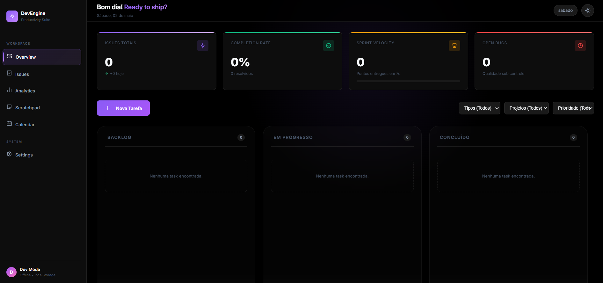

# FlowBoard - Dashboard de Produtividade Dev 🚀



## Sobre o Projeto

O **FlowBoard** é um dashboard de produtividade criado de dev para dev. Ele foi projetado para ser o seu centro de comando diário, combinando um quadro Kanban moderno, um Timer Pomodoro integrado e estatísticas detalhadas do seu desempenho. 

Com foco em fluidez e eficiência, o painel foca no que realmente importa: organizar tickets, medir a velocidade das entregas e oferecer um espaço rápido para rascunhos de código.

> **Nota:** Este projeto foi desenvolvido com o auxílio de uma Inteligência Artificial (IA) atuando como um "Pair Programmer". A IA ajudou a estruturar o React, refinar a interface (UI/UX) com dicas profissionais e solucionar erros de código em tempo real.

## Principais Funcionalidades

- **Kanban Integrado:** Arraste e solte tarefas entre as colunas "Backlog", "Em Progresso" e "Concluído".
- **Estatísticas Avançadas (Charts):**
  - Velocidade da Sprint (Sprint Velocity)
  - Taxa de Conclusão de tickets
  - Proporção entre Bugs, Features e Refactors.
- **Timer de Foco Profundo:** Um temporizador Pomodoro integrado (25, 45 ou 60 min) focado em evitar o *code fatigue*.
- **Integração com Google Agenda:** Visualize seus compromissos diários diretamente no painel.
- **Rascunho de Desenvolvimento (Scratchpad):** Salve trechos de código, logs de erro e anotações rápidas, com salvamento automático.
- **Persistência Local e Nuvem:** Dados salvos localmente e integração preparada para o Firebase (Firestore & Auth).

## Tecnologias Utilizadas

- **React 19 + Vite:** Alta performance e build ultra-rápido.
- **Chart.js + React-Chartjs-2:** Gráficos bonitos e responsivos.
- **@hello-pangea/dnd:** Para interações fluidas de Drag-and-Drop no Kanban.
- **Framer Motion:** Micro-animações e transições elegantes.
- **Firebase:** Sincronização em nuvem e autenticação.
- **CSS Vanilla (Custom Properties):** Design system focado em temas escuros, glassmorphism e cores vibrantes.

## Como Executar

1. Clone o repositório:
   ```bash
   git clone https://github.com/silvagithub21/dashboarddev
   ```
2. Instale as dependências:
   ```bash
   npm install
   ```
3. Inicie o servidor de desenvolvimento:
   ```bash
   npm run dev
   ```
4. Acesse `http://localhost:5173` (ou a porta informada no terminal).

## Contribuição

Sinta-se à vontade para abrir issues ou pull requests com melhorias. Toda contribuição para tornar o ambiente de trabalho dos desenvolvedores mais organizado é bem-vinda!

---
Desenvolvido por **kleberdev** (com a ajuda de uma IA 🤖).
